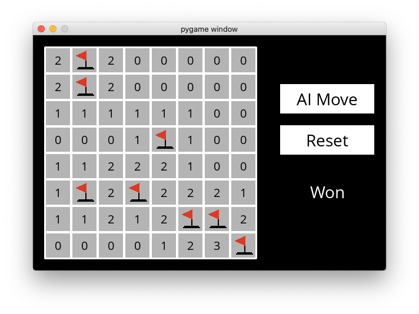

# Minesweeper AI

## Background
Minesweeper is a classic puzzle game where the player must uncover all the safe cells on a grid without detonating any hidden mines. Each cell either contains a mine or a number indicating how many neighboring cells contain mines. The goal is to flag all the mines without detonating any of them.

## Propositional Logic
To build an AI for Minesweeper, we'll represent each cell as a propositional variable that is true if the cell contains a mine, and false otherwise. We'll use logical sentences to represent the knowledge of the AI about the game board. For example, {A, B, C} = 1 means that exactly one of the cells A, B, or C is a mine.

## Knowledge Representation
Our AI will gather knowledge about the Minesweeper board and make inferences to uncover safe cells. We'll represent logical sentences as sets of cells and a count of how many of those cells are mines. This representation allows for efficient inference about safe and mine-containing cells based on the knowledge gained from revealed cells.

## Getting Started
1. Download the distribution code from the provided link and unzip it.
2. Navigate to the project directory and install the required Python package using `pip3 install -r requirements.txt`.
3. You'll find two main files: `runner.py` for running the graphical interface and `minesweeper.py` for the game logic and AI implementation.

## Understanding
- **minesweeper.py**: Contains the game logic and AI implementation.
    - `Minesweeper`: Handles the gameplay.
    - `Sentence`: Represents logical sentences about the game board.
    - `MinesweeperAI`: Implements the AI that plays Minesweeper.
- **runner.py**: Code for running the graphical interface to play Minesweeper.

## Specification
Complete the implementations of the `Sentence` class and the `MinesweeperAI` class in `minesweeper.py`.
- **Sentence class**: Implement `known_mines`, `known_safes`, `mark_mine`, and `mark_safe` functions.
- **MinesweeperAI class**: Implement `add_knowledge`, `make_safe_move`, and `make_random_move` functions.

## Tasks Summary
- **Known Mines and Safes**: Determine known mines and safes based on logical sentences.
- **Mark Mine and Mark Safe**: Update sentences when a cell is marked as a mine or safe.
- **Add Knowledge**: Update AI's knowledge based on revealed safe cells and their counts.
- **Make Safe Move**: Find a safe move based on current knowledge.
- **Make Random Move**: Choose a random move if no safe move is guaranteed.

Follow the specifications provided in the comments of the code for each function to ensure correct implementation.

Now, you're ready to dive into the code and implement the Minesweeper AI! Have fun exploring and building your AI.